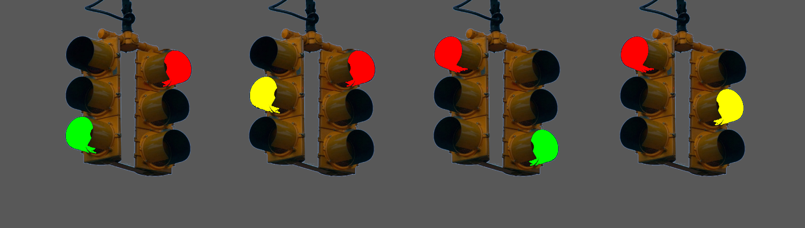

#code-u-level-2

Table of Contents:
 - [What is A.I.?](#what-is-ai)
 - [What is an algorithm?](#what-is-an-algorithm)
   - [Four categories of algorithms](#four-categories-of-algorithms)
   - [What is a deterministic algorithm?](#what-is-a-deterministic-algorithm)
   - [Nondeterministic algorithms](#nondeterministic-algorithms)
   - [Algorithm vocab](#algorithm-vocab)
 - [A.I. Timeline](#ai-timeline)
   - [1700](#1700)
   - [1800](#1800)
   - [1900](#1900)
   - [Markov chains](#markov-chains)
   - [Markov vocab](#markov-vocab)
   - [1950](#1950)
   - [1975](#1975)
   - [2000](#2000)
   - [2020](#2020)  

## What is A.I.?

"AI" is a marketing term. It doesn't refer to a coherent set of technologies. Instead, the phrase “artificial intelligence” is deployed when the people building or selling a particular set of technologies will profit from getting others to believe that their technology is similar to humans, able to do things that, in fact, intrinsically require human judgement, perception, or creativity. [^1]

According to Bender and Hanna[^1], the term AI is commonly used when referencing automation of:
- Decision making
- Classification
- Recommendation
- Transcription/Translation
- Text and Image Generation

Automated Decision Making can be very controversial. For example, in the process of setting bail, approving loans, screening résumés, or allocating social benefits. [^1] 

These tasks *could* be accomplished by rule-based algorithms. No machine-learning is required.

### What is an algorithm?

Khan Academy: What is an algorithm and why should you care https://www.khanacademy.org/computing/computer-science/algorithms/intro-to-algorithms/v/what-are-algorithms

Rule-based algorithms are constructed by a human and are direct and unambiguous. You can imagine these algorithms as following the logic of a cake recipe. Step one: do this. Step two: if this, then that.[^2]

Consider the ghosts in the game Pac-Man. They follow rule-based algorithms. https://pacman.fandom.com/wiki/Maze_Ghost_AI_Behaviors

Machine-learning algorithms are inspired by how living creatures learn. You give the machine data, a goal and feedback when it’s on the right track – and leave it to work out the best way of achieving the end.[^2]

### Four categories of algorithms

Fry[^2] states that there are four main categories of algorithms:
- Prioritization: ranking
- Classification: categorizing
- Association: finding patterns
- Filtering: selecting/removing

Check For Understanding:
- In which category would you place a sorting algorithm? A search algorithm?

### What is a deterministic algorithm?

It's important to understand the difference between deterministic and non-deterministic algorithms. A binary search is a simple example of a deterministic algorithm.

Khan Academy: binary search https://www.khanacademy.org/computing/computer-science/algorithms/binary-search/a/binary-search

Many sorting algorithms are deterministic.
- Selection sort
- Insertion sort
- Merge sort (the fastest of these 3)

Deterministic algorithms always produce the exact same output given the same input. Non-deterministic might produce different output with the same input.

### Nondeterministic algorithms

One of the fastest, general-purpose sorting algorithms is Quicksort which randomly divides the work into smaller parts. Because it uses randomness, it is nondeterministic.

Quicksort vs Bubble sort video: [https://www.youtube.com/watch?v=aXXWXz5rF64](https://www.youtube.com/watch?v=aXXWXz5rF64)

Check For Understanding:
- A filtering algorithm removes some elements from a dataset. Give me an example of how a deterministic filtering algorithm might behave. How might a non-deterministic filtering algorithm behave.
- Give me an example of how you would test a deterministic algorithm. 

Deterministic algorithms usually can be tested with several simple test.

Nondeterministic algorithms must be tested with MANY repeated test. This is known as the Monte Carlo method [https://en.wikipedia.org/wiki/Monte_Carlo_method](https://en.wikipedia.org/wiki/Monte_Carlo_method). The more tests you run, the closer you get to the accurate probabilities. This is related to the Law of Large Numbers [https://en.wikipedia.org/wiki/Law_of_large_numbers](https://en.wikipedia.org/wiki/Law_of_large_numbers)

You might hear multiple, related terms used to refer to randomness:
- Deterministic means nonrandom. Always produces the same predictable output when given the same input.
- Nondeterministic means that the system may not produce the same exact output when given the same input.
- Probabilistic means involving random chance.
- Stochastic means that a system is designed with some randomness and the probabilites are known.
- A Stochastic Process is a random change occurring in relation to time.

For the purposes of this course, I would like you to remember the terms Deterministic, Nondeterministic, and Stochasitc.

### ALGORITHM VOCAB

<dl>
  <dt>algorithm</dt><dd>a set of steps for a computer program to accomplish a task.</dd>
  
  <dt>Artificial Intelligence</dt><dd>Also known as AI, a marketing term for technology that is similar to human</dd>

  <dt>association</dt><dd>finding patterns, connections, or relationships between items</dd>

  <dt>classification</dt><dd>selecting categories for items according to shared qualities or characteristics</dd>

  <dt>computer vision</dt><dd>a field of study concerned with giving computers the ability to find patterns in images and video</dd>

  <dt>deterministic algorithm</dt><dd>an algorithm that will always produce the same predictable output when given the same input</dd>

  <dt>filtering</dt><dd>selecting, keeping, or removing specific items in a larger dataset</dd>

  <dt>machine learning</dt><dd>Also known as ML, a field of study concerned with giving computers the ability to make connections and perform a task without being explicitly programmed </dd>

  <dt>machine learning algorithm</dt><dd>an algorithm that receives training data, analyses the data to look for patterns, and attempts to predict correct outputs based on its training</dd>

  <dt>nondeterministic algorithm</dt><dd>an algorithm that may not produce the same exact output when given the same input</dd>

  <dt>prioritization</dt><dd>deciding the rank, importance, or urgency of items</dd>

  <dt>rule-based algorithm</dt><dd>an algorithm that is are constructed by a human and is direct and unambiguous</dd>

  <dt>search algorithm</dt><dd>an algorithm for locating a specific value within a list or determining that that the value in not present</dd>

  <dt>sorting algorithm</dt><dd>an algorithm that puts elements of a list into an order</dd>

  <dt>stochastic algorithm</dt><dd>an algorithm that is designed with some randomness and the probabilities are known</dd>

<dt></dt><dd></dd>
</dl>

## A.I. Timeline

### 1700

1713: In the book "Ars Conjectandi" Jacob Bernoulli proved the weak law of large numbers. If you keep flipping an unbiased coin, the proportion of heads-to-tail will start out uneven, but will approach 50-50 as the number of flips approaches infinity.

Khan Academy: Origin of Markov chains (1st half of video) [https://www.khanacademy.org/computing/computer-science/informationtheory/moderninfotheory/v/markov_chains](https://www.khanacademy.org/computing/computer-science/informationtheory/moderninfotheory/v/markov_chains)

1770: The first Mechanical Turk is constructed. This fake, chess-playing robot is actually operated by a hidden human inside of the machine. As a child, Theodore Roosevelt saw one in London ~1870.[^3]

### 1800

1811: During the Industrial Revolution in England, weavers were being replaced by weaving machines. The Luddites smashed the weaving machines that automated their jobs. Today the term is used to mean a person that rejects or refuses to learn new technology. The Luddites were most likely protesting unsafe working conditions, long hours, and low pay.[^1]

### 1900

1900, Clever Hans is a traveling circus attraction. Presented as a horse that can do arithmetic by tapping its hoof. The horse is not actually doing math but is reading the body language of the people in the room.

1906, Andrey Markov applies Bernoulli's law of large numbers to sequences of vowels and consonants in text. He was trying to prove that the law of large numbers applies to natural systems and dependent variables.

### Markov chains

Khan Academy: Origin of Markov chains (2nd half of video) [https://youtu.be/Ws63I3F7Moc?t=185](https://youtu.be/Ws63I3F7Moc?t=185)

How would Markov model a baseball game or a football game?

Markov Chain: [https://en.wikipedia.org/wiki/Markov_chain](https://en.wikipedia.org/wiki/Markov_chain)

Finite State Machine: [https://en.wikipedia.org/wiki/Finite-state_machine](https://en.wikipedia.org/wiki/Finite-state_machine)

Khan Academy: A mathematical theory of communication [https://www.youtube.com/watch?v=WyAtOqfCiBw](https://www.youtube.com/watch?v=WyAtOqfCiBw)

1942, science fiction writer Isaac Asimov writes Three Law of Robotics:
1. A robot may not injure a human being or, through inaction, allow a human being to come to harm.
2. A robot must obey the orders given it by human beings except where such orders would conflict with the First Law.
3. A robot must protect its own existence as long as such protection does not conflict with the First or Second Law.

Relevant xkcd https://xkcd.com/1613/

A.I. boosters will sometimes talk about doomsday scenarios in which intelligent robots kill humans. There is a shortcut for discussing the probability of A.I. doomsday: p(doom). Why? It can be useful to those creating the tech because it makes them appear powerful—if not godlike—in their technical creation. Doomsday talk can make the tech seem dangerous and cool, and make the doomsayer seem smart and visionary. Doomsday can also distract from current-day problems.

1948, engineer/mathematician Claude Shannon publishes a paper titled "The Mathematical Theory of Communication" which proposes the first n-gram language models based on Markov’s work.[^1]

### MARKOV VOCAB

<dl>
<dt>n-gram</dt><dd>a sequence of a specific number of adjacent elements</dd>

<dt>bigram</dt><dd>a sequence of two consecutive elements</dd>

<dt>trigram</dt><dd>a sequence of three consecutive elements</dd>

<dt>finite state machine</dt><dd> a hardware or software device that has multiple modes and that it can be in only one mode at a time. For example, a traffic light can either be in the green-red state, yellow-red state, red-green state, or red-yellow state</dd>

<dt>markov chain</dt><dd>a mathematical system that transitions from one state to another based on probabilities</dd>

<dt>law of large numbers</dt><dd>as the sample size increases, the average result should get closer to the ideal result</dd>

<dt>monte carlo simulation</dt><dd>a computational approach that applies the law of large numbers in order to predict and understand the behaviour of systems involving uncertainty</dd>

<dt>mechanical turk</dt><dd>a fake, chess-playing robot</dd>

<dt>luddite</dt><dd>someone who is opposed to new technologies or technological change</dd>

<dt>supervised learning</dt><dd>a type of machine learning where an algorithm learns from examples that include labeled input data and correctly labeled answers</dd>

<dt>unsupervised learning</dt><dd>similar to self-supervised learning, a type of machine learning where an algorithm studies data without labels to find hidden patterns, unknown groups, or unusual anomalies</dd>

<dt>self-supervised learning</dt><dd>similar to unsupervised learning, a method where an algorithm creates its own labels from unlabeled data. The algorithm generates variations so it can learn to predict parts of the data from other parts</dd>

<dt>pre-trained model</dt><dd>a machine learning model that has already been trained on a large dataset to perform a specific task</dd>

<dt>self-learning model</dt><dd>a machine learning model thatthat keeps learning and improving on its own as it gets more data or experience</dd>

<dt>Jacob Bernoulli</dt><dd>wrote the book "Ars Conjectandi" that proved the weak law of large numbers</dd>

<dt>Andrey Markov</dt><dd>applied Bernoulli's law of large numbers to sequences of vowels and consonants in text. He was trying to prove that the law of large numbers applies to natural systems and dependent variables</dd>

<dt>Isaac Asimov</dt><dd>science fiction writer that created Three Laws of Robotics</dd>

<dt>Claude Shannon</dt><dd>published a paper titled "The Mathematical Theory of Communication" which proposes the first n-gram language models based on Markov’s work</dd>

</dl>

### 1950

1950s, Frank Rosenblatt implements the first neural net based on proposed algorithms by McCulloch and Pitts.[^1]

1950s: Alan Turing writes a paper titled *Computing Machinery and Intelligence* and states that the question “Can machines think?” Is too vague. He proposes an imitation game to answer a differ question, can humans be fooled by machines? Can a computer-pretending-to-be-a-man can fool a judge more often than a man-pretending-to-be-someone-else? This question is now known as the Turing Test.[^1]

1952, the vice president of Ford Motor Company, John Diebold, coins the term "automation"

VOCAB

neural network 
: multi-layer algorithms that take in multiple inputs then calculate what value to output
The Turing Test
: the question of whether a computer-pretending-to-be-a-man can fool an judge more often than a man-pretending-to-be-someone-else

1954: Paul Meehl publishes *Clinical versus Statistical Prediction* which compares the performance of humans and algorithms. Other studies in the half-century since have confirmed Meehl’s findings that algorithms perform better than humans at tasks involving calculating, predicting, and assessing.

1956: mathematician John McCarthy and computer scientist Marvin Minsky organized a summer-long workshop at Dartmouth College in Hanover, New Hampshire, to discuss a set of methods around “thinking machines”. The term “artificial intelligence” is attributed to John McCarthy. Minsky later founded MIT’s A.I. laboratory.

In the late 1960s, Joseph Weizenbaum, a professor at the Massachusetts Institute of Technology, and contemporary of Minsky, was alarmed by how quickly people attributed agency to automated systems. Weizenbaum developed a chatbot called ELIZA, named for the working-class character in George Bernard Shaw’s Pygmalion who learns to mimic upper-class speech. ELIZA was designed to carry on a conversation in the style of a Rogerian psychotherapist; that is, the program primarily repeated what its users said, reframing their thoughts into questions. …computer scientists used ELIZA to celebrate how thoroughly computers could replicate human labor… A shocked Weizenbaum spent the rest of his life as a critic of AI[^1] 

1970s: In the Stanley Kubrick film “2001: A Space Odyssey” the computer HAL 9000 is an advanced, speech-enabled AI that runs the spaceship. When HAL malfunctions, the humans try to shut it down, but HAL fights back. In the book “The Hitchhiker’s Guide to the Galaxy” by Douglas Adams, the supercomputer Deep Thought is asked to give “the Answer to the Ultimate Question of Life, the Universe and Everything” and 7.5 million years later gives the answer 42.

### 1975

1979: An IBM training presentation includes a slide that states “A computer can never be held accountable, therefore a computer must never make a management decision.” Another slide from the same presentation reads “Putting a bad system on line is like pouring gasoline into a fire.”[^1]

September 1983: Stanislav Petrov chooses to ignore an alarm that Soviet satellites had detected an enemy missile headed for Russian territory. It turns out to be a false alarm. [^2]

1997: ShotSpotter is a system for detecting gunshots and alerting police. The company claims they have a 97% aggregate accuracy rate and a false positive rate less than 0.5%. Audits in Chicago and NYC found 87-91% were false alarms.[^1]

May 1997: IBM’s Deep Blue defeats chess grandmaster Garry Kasparov

### 2000

Early 2000s, Google Search outpaces human-curated directories like Yahoo! and Lycos. Google’s automated algorithm uses number of links pointing to a site as well as several other technical factors to rank a website. The field of search engine optimization (SEO) is created to try to get one’s website higher in a Google ranking.[^1]

November 2005: Amazon’s Mechanical Turk (AMT or MTurk) is launched. MTurk is a crowdwork platform for outsourcing labor for small online tasks. In a patent for the service, Amazon refers to it as “artificial artificial intelligence”[^1]

November 2015: The Google Brain team releases TensorFlow, a popular, open-source machine learning library.[^1]

March 2016: _K.W. v. Armstrong_ class action suit. The Idaho Department of Health and Welfare refuses to disclose the reasons for cutting individuals’ Medicaid assistance, claiming its decision-making formulas were “trade secrets” and the formula used to calculate the benefits was not available to the public. A federal judge rules that the algorithm is unconstitutional because it “arbitrarily deprives participants of their property rights and hence violates due process.” [Source](https://www.aclu.org/press-releases/federal-court-rules-against-idaho-department-health-and-welfare-medicaid-class-action) “…the data they used to come up with their formula for setting people’s assistance limits was corrupt. They were using historical data to predict what was going to happen in the future. But they had to throw out two-thirds of the records they had before they came up with the formula because of data entry errors and data that didn’t make sense. So they were supposedly predicting what this population was going to need, but the historical data they were using was flawed, and they were only able to use a small sub-set of it. And bad data produces bad results.” [Source](https://www.aclu.org/news/privacy-technology/pitfalls-artificial-intelligence-decisionmaking-highlighted-idaho-aclu-case)

November 2016: Google Brain researcher and deep learning specialist Geoffrey Hinton claims that we should stop training radiologists because AI can read x-rays better than humans. Today there are more medical imaging jobs than in 2016.[^1]

2017: The Future of Life Institute develops The Asilomar AI Principles.[^1]

May 2018: The EU’s General Data Protection Regulation (aka GDPR) goes into effect. The law stresses privacy rights and a person’s control of their personal data. It prevents companies and governments from storing data forever, makes them state why they want to collect your data, and allows the consumer to opt in or opt out.[^1]

### 2020

August 2020, thousands of British students36, unable to take their A-level exams due to the COVID-19 pandemic, received grades calculated based on an algorithm that took as input, among other things, the grades that other students at their schools received in previous years.

November 2022: Tesla releases Full Self-Driving (FSD) beta mode for North America. 8 months later (June 10, 2023) The Washington Post publishes a report titled “17 Fatalities, 736 Crashes: The Shocking Tolles of Tesla’s Autopilot” [Source](https://www.washingtonpost.com/technology/2023/06/10/tesla-autopilot-crashes-elon-musk/) The website [tesladeaths.com](https://www.tesladeaths.com/) tracks Tesla crash data including each claimed and confirmed FSD autopilot reports.

March 2023: the Future of Life Institute releases a letter calling for a pause on AI training. There are 30,000 co-signers including Elon Musk. This letter is commonly known as “The AI Pause Letter”[^1]

May 2023: the Center for AI Safety releases a statement that says “Mitigating the risk of extinction from AI should be a global priority alongside other societal-scale risks such as pandemics and nuclear war.” Signed by hundreds including Sam Altman and Bill Gates[^1]

October 2023: Marc Andreessen writes “Techno-Optimist Manifesto“

November 2023, the estates of the two named plaintiffs, deceased at the time of filing, alleged that UnitedHealth kicked them out of care too early, based on nH Predict’s output, even as the company knew the system had an error rate of 90 percent [^1]

2023: Dr Sasha Luccioni and colleagues released a study on “The Environmental Impacts of AI” and found that the training of one LLM released about 50 tons of carbon or the equivalent of a dozen flights from New York City to Sydney, Australia.[^1]

2023: Unions for tv/film writers (Writers Guild of America) and actors (SAG-AFTRA) strike against AI replacement. The strike ended when studios and unions reached an agreement that put limits on AI use, increased pay for writers, and requirements for an actor’s consent to create a digital replica.[^1]

2023: self-driving car company Cruise admits that its “driverless” robotaxis were monitored and controlled (as needed) by remote workers[^1]

2023: Columbus Dispatch caught using AI when an article states: <code>“The Worthington Christian \[\[WINNING-TEAM-MASCOT\]\] defeated the Westerville North \[\[LOSING-TEAM-MASCOT\]\] 2-1 in an Ohio boys soccer game on Saturday.”</code> [Source](https://www.npr.org/2023/09/09/1198582885/opinion-high-schoolers-can-do-what-ai-cant)

June 2024: Microsoft announces a Windows 11 feature called “Recall” that takes a screenshot every 5 seconds and feeds the screenshot to an AI.[^1]

Vocab

LLM
: Large Language Model, 
AGI
: Artificial General Intelligence,
Classification 
:
OCR
: Optical Character Recognition, a technology used to extract text from images or screenshots
GPT
: Generative Pre-trained Transformer, a type of neural net model used by some chatbots. Also General Purpose Technology, a hypothetical machine that can do everything.
FOMO
: Fear of missing out, anxiety that you might be excluded from beneficial events or experiences
p(doom)
: probability of doom, a percentage that expresses someone’s personal outlook of the probability of AI dystopia

unsupervised learning
: a strategy 
perceptron
: a mathematical function that independently would be considered a single-layer neural net. Typically connected in a multi-layer network with each given a weight
ELIZA
:
MIT
:
Agency
: freedom of choice
corpus
:
enshittification
:
SEO
: Search Engine Optimization
crowdwork 
: low-paid workers filtering, labeling, or correcting content often in ways that are unseen and unattributed for end users
outsourcing 
:

Sources

[^1]:Bender, E. M., & Hanna, A. (2025). _The ai con: How to fight big tech’s hype and create the future we want_. Harper, an imprint of HarperCollinsPublishers.

[^2]:Fry, H. (2019). _Hello world: How to be human in the age of the Machine_. Black Swan.

[^3]:McCullough, D. (2007). _Mornings on horseback_. Simon & Schuster.
